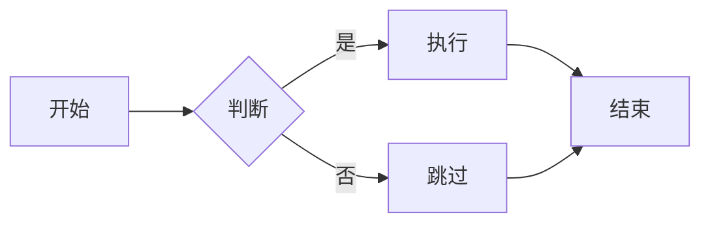
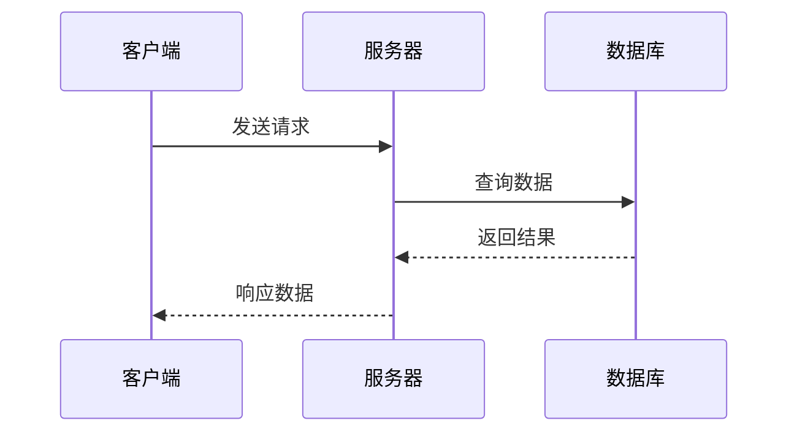
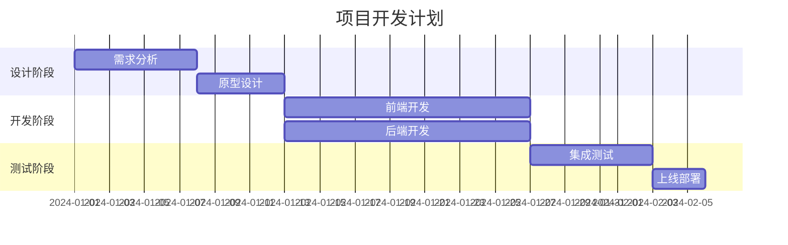
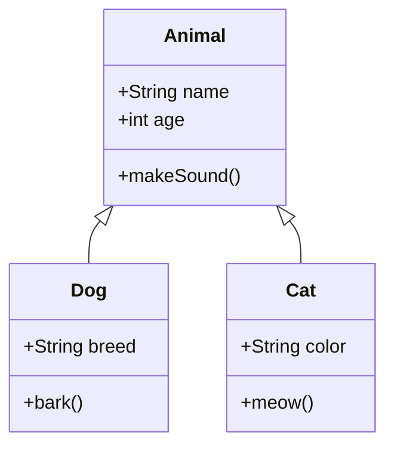
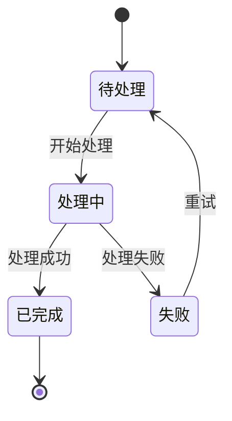
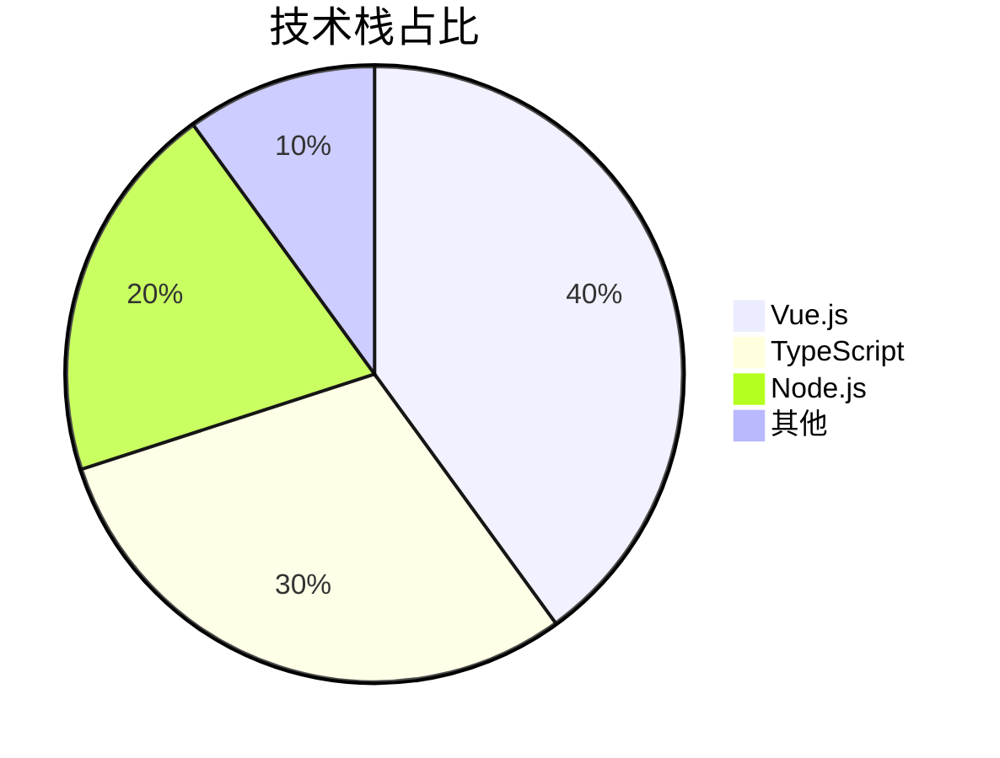

# Mermaid 图表

VitePress 支持使用 [Mermaid](https://mermaid.js.org/) 绘制各种图表，包括流程图、时序图、甘特图等。

## 流程图

## 时序图

## 甘特图

## 类图

## 状态图

## 饼图

## 更多信息

查看 [Mermaid 官方文档](https://mermaid.js.org/intro/) 了解更多图表类型和语法。
